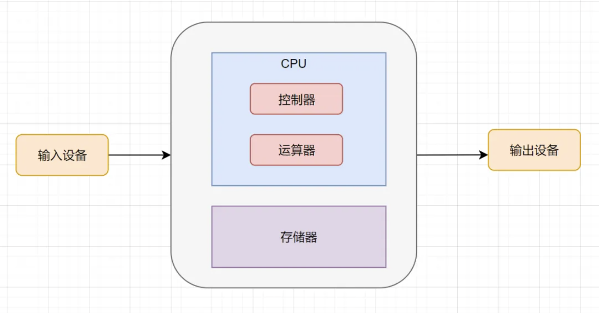
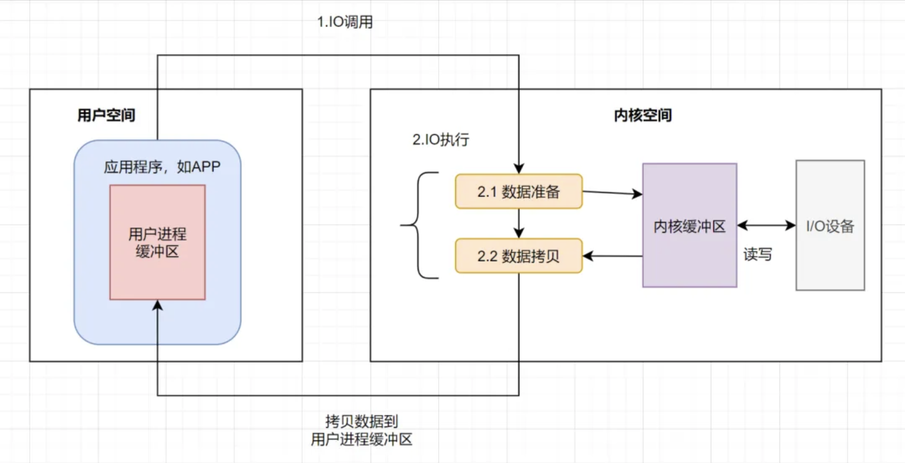
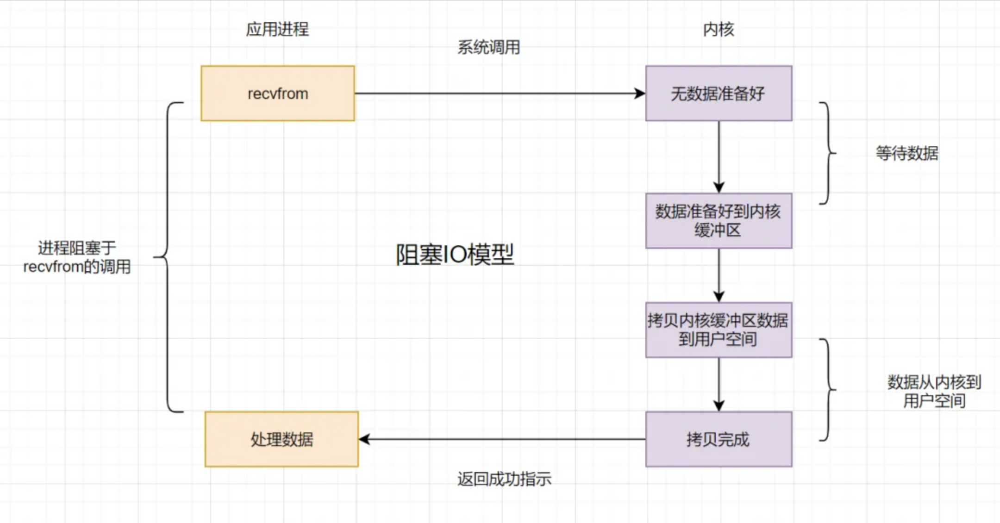
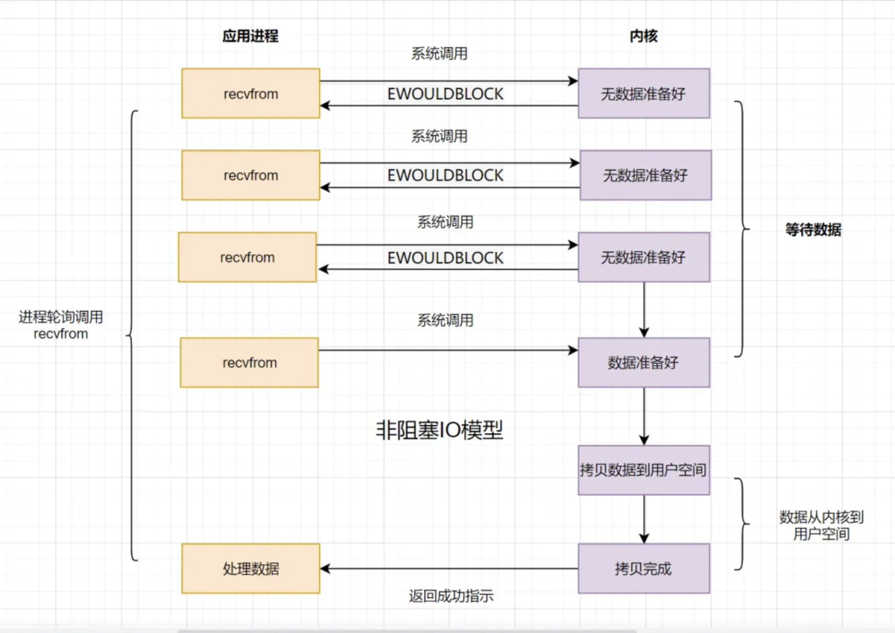
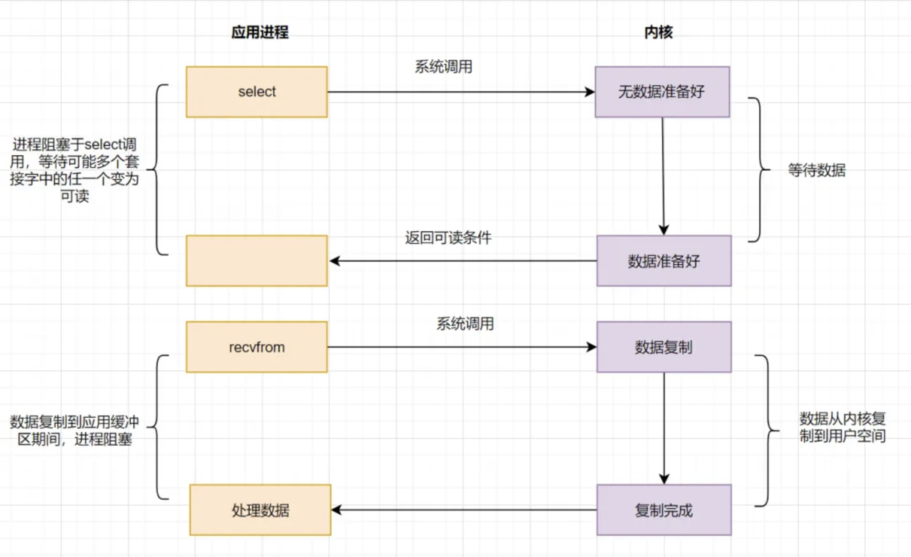
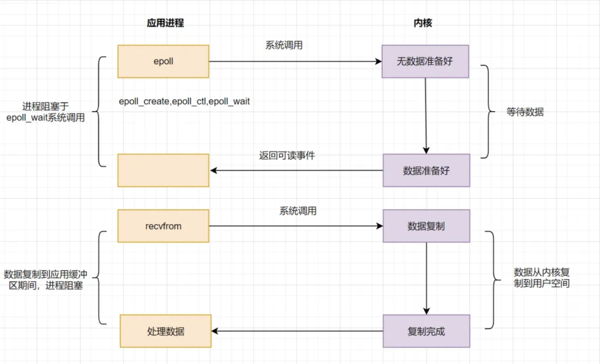
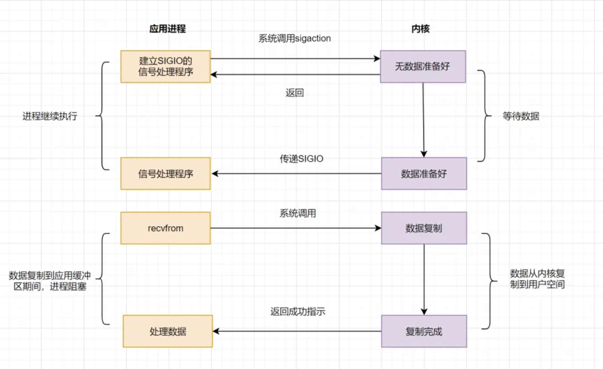
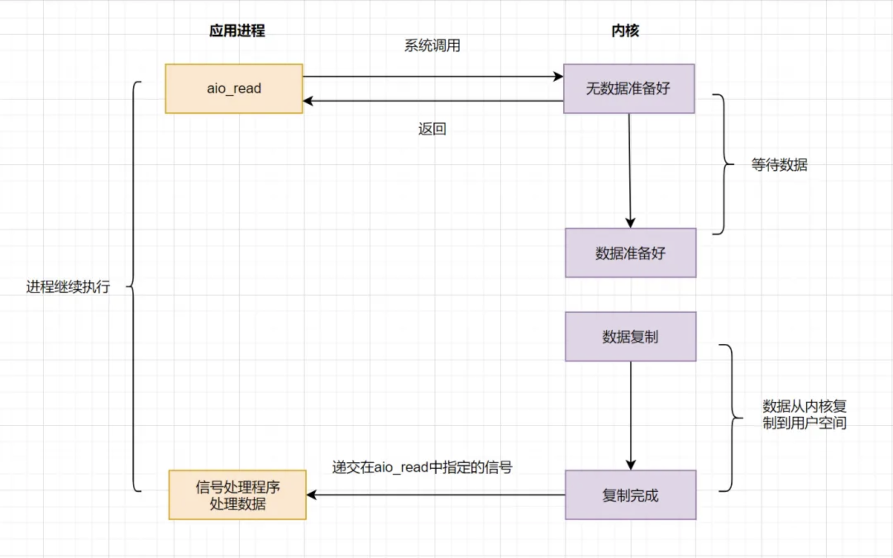

## 什么是I/O

I/O，**Input/Output**，**即输入/输出**，是计算机系统中用于数据传输的机制，指的是在计算机和外部设备（键盘、显示器、磁盘等）之间，或在计算机内部组件（内存和 CPU）之间的数据传输过程。

- **输入（input）**：指将数据从外部设备或内存传入到计算机系统的过程。
- **输出（output）**：指将数据从计算机系统传送到外部设备或内存的过程。

I/O 设备类型：

- 块设备：磁盘、光盘、USB设备等，以块为单位读写数据，适合随机访问。
- 字符设备：键盘、鼠标、串口、打印机等，以字符流为单位读写数据，适合顺序访问。

### 计算机角度的I/O

我们常说的输入输出，比较直观的意思就是**计算机的输入输出**，**计算机就是主体**。

**冯.诺依曼结构**，它将计算机分成分为5个部分：运算器、控制器、存储器、输入设备、输出设备。

- **输入设备**是向计算机输入数据和信息的设备，键盘，鼠标都属于输入设备；
- **输出设备**是计算机硬件系统的终端设备，用于接收计算机数据的输出显示，一般显示器、打印机属于输出设备。

鼠标、显示器这只是直观表面的输入输出，回到计算机架构来说，**涉及计算机核心与其他设备间数据迁移的过程，就是I/O**。

如磁盘I/O，就是从磁盘读取数据到内存，这算一次输入，对应的，将内存中的数据写入磁盘，就算输出。这就是I/O的本质。

### 操作系统的I/O

我们要将内存中的数据写入到磁盘的话，主体会是什么呢？主体可能是一个应用程序，比如一个Java进程（假设网络传来二进制流，一个Java进程可以把它写入到磁盘）。

**操作系统**负责计算机的资源管理和进程的调度。我们电脑上跑着的应用程序，其实是需要经过**操作系统**，才能做一些特殊操作，如**磁盘文件读写、内存的读写**等等。因为这些都是比较危险的操作，不可以由应用程序乱来，只能交给底层操作系统来。也就是说，你的应用程序要把数据写入磁盘，只能通过调用操作系统开放出来的API来操作。

我们应用程序是跑在用户空间的，它不存在实质的I/O过程，真正的I/O是在**操作系统**执行的。即应用程序的I/O操作分为两种动作：**I/O调用和I/O执行**。

I/O调用是由进程（应用程序的运行态）发起，而I/O执行是**操作系统内核**的工作。此时所说的I/O是应用程序对操作系统I/O功能的一次触发，即I/O调用。

> **什么是用户空间？什么是内核空间?**
>
> 以32位操作系统为例，它为每一个进程都分配了4G(2的32次方)的内存空间。这4G可访问的内存空间分为二部分，一部分是用户空间，一部分是内核空间。内核空间是操作系统内核访问的区域，是受保护的内存空间，而用户空间是用户应用程序访问的内存区域。

### 操作系统的一次I/O过程

应用程序发起的一次I/O操作包含两个阶段：

- I/O调用：应用程序进程向**操作系统内核**发起调用。
- I/O执行：操作系统内核完成I/O操作。

操作系统内核完成I/O操作还包括两个过程：

- 准备数据：内核等待I/O设备准备好数据。
- 拷贝数据：将数据从内核缓冲区拷贝到用户进程缓冲区。

其实I/O就是把进程的内部数据转移到外部设备，或者把外部设备的数据迁移到进程内部。外部设备一般指硬盘、socket通讯的网卡。一个完整的**I/O过程**包括以下几个步骤：

- 应用程序进程向操作系统发起**I/O调用请求**
- 操作系统**准备数据**，把I/O外部设备的数据，加载到**内核缓冲区**
- 操作系统拷贝数据，即将内核缓冲区的数据，拷贝到用户进程缓冲区

## I/O模型

### 阻塞 vs 非阻塞 vs 异步

- **阻塞**：调用 `read()/write()` 时，进程被挂起直至操作完成，简单易用但会导致资源空转。
- **非阻塞**：通过在文件描述符上设置 `O_NONBLOCK` 标志，使得 `read()/write()` 调用不会阻塞，而是立即返回，需配合 `select/poll` 等多路复用手段实现效率提升。
- **异步**：调用类似 `aio_read()/aio_write()`，进程发起调用后立即返回，内核完成I/O操作后通过**回调或事件通知**告知进程，无需轮询，允许并行处理其他任务。

### 五种经典 I/O 模型

#### 阻塞I/O模型 (BIO, Blocking I/O)

假设应用程序的进程发起**I/O调用**（`read()` 或 `write()`），但是如果**内核的数据还没准备好**的话，那应用程序进程就一直在**阻塞等待**，一直等到内核数据准备好了，从内核拷贝到用户空间，才返回成功提示，此次I/O操作，称之为**阻塞I/O**。

- 阻塞I/O比较经典的应用就是**阻塞socket、Java BIO**。
- 阻塞I/O的缺点就是：如果内核数据一直没准备好，那用户进程将一直阻塞，**浪费性能**，可以使用**非阻塞I/O**优化。

#### 非阻塞I/O模型 (NIO, Non-Blocking I/O)

在文件描述符上设置 `O_NONBLOCK`，使 `read()/write()` 调用立即返回，若无法立刻完成则返回 `EAGAIN`（对于套接字也可能是 `EWOULDBLOCK`），要求开发者主动轮询或结合多路复用进行事件驱动处理。

> - **成功完成**：返回实际读写的字节数（0 表示 EOF）
> - **无法立即完成（会阻塞）**：返回 -1，`errno == EAGAIN`；若是套接字，也可能 `errno == EWOULDBLOCK`
> - **其他错误**：如 `EBADF`、`EFAULT`、`EINTR` 等，根据具体场景返回对应错误码

非阻塞I/O模型，简称**NIO**，`Non-Blocking I/O`。它相对于阻塞I/O，虽然大幅提升了性能，但是它依然存在**性能问题**，即**频繁的轮询**，导致频繁的系统调用，同样会消耗大量的CPU资源。可以考虑**I/O复用模型**，去解决这个问题。

#### 多路复用I/O模型 (MIO, Multiplexing I/O)

既然**NIO**无效的轮询会导致CPU资源消耗，我们等到内核数据准备好了，主动通知应用进程再去进行系统调用，那不就好了嘛？

I/O复用模型核心思路：系统给我们提供**一类函数**（**select、poll、epoll**函数），在单个线程中监控大量**文件描述符**的可读写状态，实现阻塞或边缘触发的事件分发机制，从而避免因阻塞 I/O 导致的线程资源浪费。

> 在 UNIX/Linux 中，**文件描述符（FD，File Descriptor）** 是内核为每个已打开资源（常见有普通文件、管道、套接字、字符设备等）分配的一个**非负整数**，它充当用户空间进程与内核 I/O 子系统之间的句柄。例如：
>
> - FD = 0：标准输入（stdin）
> - FD = 1：标准输出（stdout）
> - FD ≥ 3：其他打开的文件或套接字
>
> 所有 I/O 系统调用（如 `read(fd, buf, n)`、`write(fd, buf, n)`）均通过这个整数索引来标识目标资源。

##### select

应用进程通过调用**select**函数，可以同时监控多个 `fd`，在 `select`函数监控的 `fd` 中，只要有任何一个数据状态准备就绪了，`select` 函数就会返回可读状态，这时应用进程再发起 `recvfrom` 请求去读取数据。

非阻塞I/O模型（NIO）中，需要 `N`（N>=1）次轮询系统调用，然而借助 `select` 的I/O多路复用模型，只需要发起一次询问就够了，大大优化了性能。

但是呢，`select`有几个缺点：

- 监听的I/O最大连接数有限，在Linux系统上一般为1024。
- select函数返回后，是通过**遍历** `fdset`，找到就绪的描述符 `fd`。（仅知道有I/O事件发生，却不知是哪几个流，所以**遍历所有流**）

因为**存在连接数限制**，所以后来又提出了**poll**。与select相比，**poll**解决了**连接数限制问题**。但是呢，select和poll一样，还是需要通过遍历文件描述符来获取已经就绪的 `socket`。如果同时连接的大量客户端，在一时刻可能只有极少处于就绪状态，伴随着监视的描述符数量的增长，**效率也会线性下降**。

因此经典的多路复用模型 `epoll`诞生。

##### epoll

为了解决 `select/poll`存在的问题，多路复用模型 `epoll`诞生，它采用事件驱动来实现，流程图如下：

**epoll**先通过 `epoll_ctl()` 来注册一个 `fd`，一旦基于某个 `fd` 就绪时，内核会采用回调机制，迅速激活这个 `fd`，当进程调用 `epoll_wait()`时便得到通知。这里去掉了**遍历文件描述符**的操作，而是采用**监听事件回调**的机制。这就是epoll的亮点。

##### select、poll、epoll的区别

|              | select                                               | poll                                               | epoll                                                        |
| ------------ | ---------------------------------------------------- | -------------------------------------------------- | ------------------------------------------------------------ |
| 底层数据结构 | 数组                                                 | 链表                                               | 红黑树和双链表                                               |
| 获取就绪的fd | 遍历                                                 | 遍历                                               | 事件回调                                                     |
| 事件复杂度   | O(n)                                                 | O(n)                                               | O(1)                                                         |
| 最大连接数   | 1024                                                 | 无限制                                             | 无限制                                                       |
| fd数据拷贝   | 每次调用select，需要将fd数据从用户空间拷贝到内核空间 | 每次调用poll，需要将fd数据从用户空间拷贝到内核空间 | 使用内存映射(mmap)，不需要从用户空间频繁拷贝fd数据到内核空间 |

**epoll**明显优化了I/O的执行效率，但在进程调用 `epoll_wait()`时，仍然可能被阻塞。

#### 信号驱动I/O模型 (SDIO, Signal-driven I/O)

信号驱动I/O不再用主动询问的方式去确认数据是否就绪，而是向内核发送一个信号（调用 `sigaction` 的时候建立一个 `SIGIO` 的信号），然后应用用户进程可以去做别的事，不用阻塞。当内核数据准备好后，再通过 `SIGIO` 信号通知应用进程，数据准备好后的可读状态。应用用户进程收到信号之后，立即调用 `recvfrom`，去读取数据。

信号驱动I/O模型，在应用进程发出信号后，是立即返回的，不会阻塞进程。它已经有异步操作的感觉了。但是你细看上面的流程图，**发现数据复制到应用缓冲的时候**，应用进程还是阻塞的。回过头来看下，不管是BIO，还是NIO，还是信号驱动，在数据从内核复制到应用缓冲的时候，都是阻塞的。

#### 异步I/O模型 (AIO, Asynchronous I/O)

前面讲的 `BIO`，`NIO`和`SDIO`，在数据从内核复制到应用缓冲的时候，都是**阻塞**的，因此都不算是真正的异步。`AIO`实现了I/O全流程的非阻塞，就是应用进程发出系统调用后，是立即返回的，但是**立即返回的不是处理结果，而是表示提交成功类似的意思**。等内核数据准备好，将数据拷贝到用户进程缓冲区，发送信号通知用户进程I/O操作执行完毕。

异步I/O的优化思路很简单，只需要向内核发送一次请求，就可以完成数据状态询问和数据拷贝的所有操作，并且不用阻塞等待结果。日常开发中，有类似思想的业务场景：

> 比如发起一笔批量转账，但是批量转账处理比较耗时，这时候后端可以先告知前端转账提交成功，等到结果处理完，再通知前端结果即可。

### I/O 模型对比

| 模型                       | 调用时阻塞？ | 数据就绪时阻塞？ | 特点                            | 常见应用       |
| -------------------------- | ------------ | --------------- | ------------------------------- | -------------- |
| 阻塞 I/O（Blocking I/O）   | 是           | —               | 最简单，单线程也能完成          | Java BIO    |
| 非阻塞 I/O（Non-Blocking） | 否           | 是              | 需轮询 `EAGAIN`                  | C++ low-level |
| 多路复用 I/O                | 否           | 否              | 单线程管理上万 FD，不轮询所有 FD | Nginx、Node.js |
| 信号驱动 I/O（SIGIO）       | 否           | 是              | 用信号通知，信号处理函数中读写   | 较少使用       |
| 异步 I/O（POSIX AIO）       | 否           | 否              | 真异步，全流程不阻塞             | 高性能文件服务  |

### 何时选哪种模型

- **简单脚本／小工具**：阻塞 I/O 足矣。
- **多连接高并发**：首选多路复用（`epoll`/`kqueue`）＋非阻塞。
- **极致性能**：结合零拷贝（`sendfile`、`splice`）或 Linux `io_uring`。
- **跨平台服务**：可借助 Java Netty、Rust Tokio、Go runtime 等，它们底层封装了最佳模型。

## 拓展

- **[零拷贝技术](/p/zero-copy/)**：`sendfile()`、`splice()`、`mmap()`
- **[io_uring](/p/io_uring/)**：Linux 5.1+ 提供的真正零系统调用异步接口
- **Windows IOCP**：高性能 proactor 模型
- **虚拟化 I/O**：Virtio、SR-IOV、DDIO 加速
