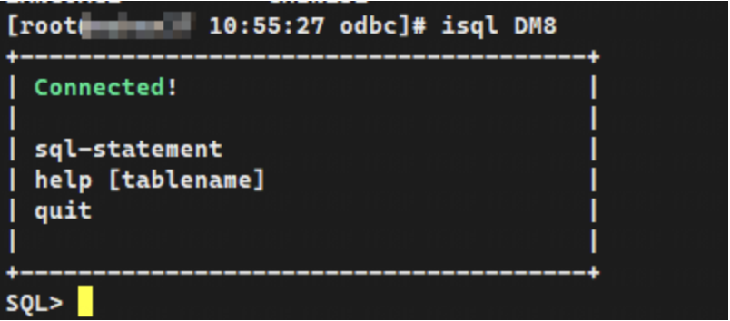

- **ODBC, Open Database Connectivity** 是由 Microsoft 开发的数据库连接标准。
- 它允许应用程序使用标准化的接口访问不同的数据库系统。

## 特点

- **跨语言支持**：
  - ODBC 不是绑定于某种编程语言的，因此可以用于多种编程语言，包括 C、C++、Python 等。
- **平台依赖性**：
  - ODBC 原本是为 Windows 平台设计的，但也有跨平台版本，如 unixODBC 用于 Linux 系统。
- **使用方式**：
  - ODBC 通过 ODBC 驱动与数据库通信。驱动程序通常由数据库供应商提供，或者可以使用第三方驱动。
  - ODBC 需要在系统中配置数据源名称（DSN），通过 DSN 来标识和连接数据库。

## 使用

[参考地址](https://www.easysoft.com/developer/interfaces/odbc/linux.html#getting_unixodbc)

### 安装驱动

- Ubuntu/Debian
  - `sudo apt-get install unixodbc unixodbc-dev odbcinst`
- CentOS/RHEL
  - `sudo yum install unixODBC unixODBC-devel`
- Windows
  在 Windows 上，你可以通过安装 ODBC 数据源管理器和相应的数据库驱动来支持 ODBC。

### 配置数据源

Linux下，odbc依赖两个配置文件（以达梦8为例）

#### 配置驱动, /etc/odbcinst.ini

```ini
[DM8]
Description     = ODBC DRIVER FOR Dameng8
Driver          = /data0/dm_db/dmdbms/drivers/odbc/libdodbc.so
```

两个属性，

- Description，驱动说明
- Driver，驱动文件

#### 配置数据源, /etc/odbc.ini

```ini
[DM8]
Description     = DM ODBC DSN
Driver          = DM8
SERVER          = localhost
UID             = SYSDBA
PWD             = SYSDBA
TCP_PORT        = 5236
LANGUAGE        = CHINESE
```

- Description，数据源说明
- Driver，驱动，要和 odbcinst.ini 中的 **selection** 保持一致
- SERVER，连接的ip
- UID，账户名称
- PWD，账户密码
- TCP_PORT，连接端口
- LANGUAGE，环境语言

## 测试

`isql <DSN数据源名称> [UID [PWD]]`


