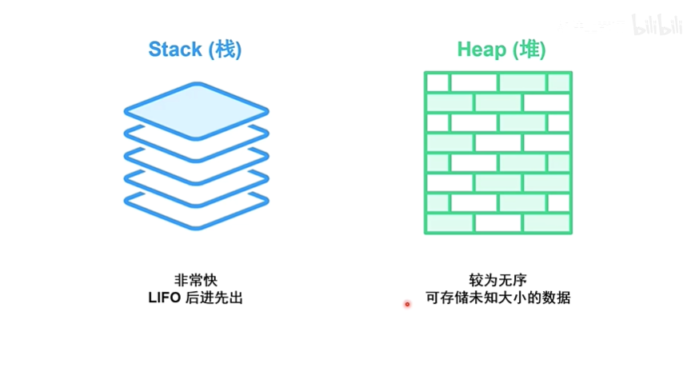

栈和堆都是代码在运行时可供使用的内存，但是它们的结构不同。

## 栈，Stack

栈以放入值的顺序存储值并以相反顺序取出值。这也被称作 **后进先出**（_last in, first out_）。

> 想象一下一叠盘子：当增加更多盘子时，把它们放在盘子堆的顶部，当需要盘子时，也从顶部拿走。
>
> **不能从中间也不能从底部增加或拿走盘子！**

增加数据叫做 **进栈**（_pushing onto the stack_），而移出数据叫做 **出栈**（_popping off the stack_）。

栈中的所有数据都必须占用已知且固定的大小。

_**在编译时大小未知或大小可能变化的数据，要改为存储在堆上。**_

## 堆，Heap

堆是缺乏组织的：当向堆放入数据时，你要请求一定大小的空间。

内存分配器（memory allocator）在堆的某处找到一块足够大的空位，把它标记为已使用，并返回一个表示该位置地址的 **指针**（_pointer_）。
这个过程称作 **在堆上分配内存**（_allocating on the heap_），有时简称为 “分配”（allocating）。（将数据推入栈中并不被认为是分配）。

因为指向放入堆中数据的指针是已知的并且大小是固定的，你可以将该指针存储在栈上，不过当需要实际数据时，必须访问指针。

> 想象一下去餐馆就座吃饭。当进入时，你说明有几个人，餐馆员工会找到一个够大的空桌子并领你们过去。
> 如果有人来迟了，他们也可以通过询问来找到你们坐在哪。

## 比较

入栈比在堆上分配内存要快，因为（入栈时）分配器无需为存储新数据去搜索内存空间；其位置总是在栈顶。
相比之下，在堆上分配内存则需要更多的工作，这是因为分配器必须首先找到一块足够存放数据的内存空间，并接着做一些记录为下一次分配做准备。

访问堆上的数据比访问栈上的数据慢，因为必须通过指针来访问。现代处理器在内存中跳转越少就越快（缓存）。

> 继续类比，假设有一个服务员在餐厅里处理多个桌子的点菜。
> 在一个桌子报完所有菜后再移动到下一个桌子是最有效率的。
> 从桌子 A 听一个菜，接着桌子 B 听一个菜，然后再桌子 A，然后再桌子 B 这样的流程会更加缓慢。
> 出于同样原因，处理器在处理的数据彼此较近的时候（比如在栈上）比较远的时候（比如可能在堆上）能更好的工作。

当你的代码调用一个函数时，传递给函数的值（包括可能指向堆上数据的指针）和函数的局部变量被压入栈中。当函数结束时，这些值被移出栈。

