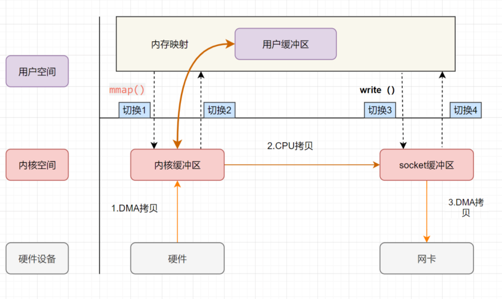

**​零拷贝（Zero-Copy）** 是一种操作系统级别的 I/O 优化技术，旨在减少或避免数据在内存中的多次拷贝，降低 CPU 占用率，提高数据传输效率，尤其适用于高并发、大吞吐量的场景，如网络通信、文件传输等。

## 传统 I/O 的调用

传统 I/O 操作中，数据需要从磁盘文件拷贝到内核空间，再从内核空间拷贝到用户空间，然后再拷贝到 `Socket Buffer` 中，再拷贝到网卡设备。

传统的 I/O 操作过程中，涉及到 **4 次上下文切换**（用户态和内核态的上下文切换）和 **4 次数据拷贝**（2 次 CPU 拷贝、2 次 DMA 拷贝）：

1. **上下文从用户态切换到内核态**：应用程序进程调用 `read` ，发起 `I/O 调用`；
2. **DMA 拷贝**：`DMA 控制器` 将数据从 `磁盘文件（硬件设备）` 拷贝到 `内核缓冲区（内核空间）`；
3. **上下文从内核态切换到用户态**：`read` 调用返回；
4. **CPU 拷贝**：`CPU` 将数据从 `内核缓冲区（内核空间）` 拷贝到 `用户缓冲区（用户空间）`；
5. **上下文从用户态切换到内核态**：应用程序进程调用 `write` ，发起 `I/O 调用`；
6. **CPU 拷贝**：`CPU` 将数据从 `用户缓冲区（用户空间）` 拷贝到 `Socket Buffer（内核空间）`；
7. **DMA 拷贝**：`DMA 控制器` 将数据从 `Socket Buffer（内核空间）` 拷贝到 `网卡设备（硬件设备）`；
8. **上下文从内核态切换到用户态**：`wirte` 调用返回。

## 零拷贝

相比 传统 I/O 调用，零拷贝通过直接拷贝数据，避免了多次拷贝操作。

> **零拷贝并不是没有拷贝数据，而是减少用户态/内核态的切换次数以及CPU拷贝的次数**。

## 零拷贝的实现方式

### mmap + write

1. **上下文从用户态切换到内核态**：应用程序进程发起 `mmap` 调用；
2. **DMA 拷贝**：`DMA 控制器` 将数据从 `磁盘文件（硬件设备）` 拷贝到 `内核缓冲区（内核空间）`；
3. **上下文从内核态切换到用户态**：`内核缓冲区（内核空间）` 地址和 `用户缓冲区（用户空间）`地址映射，内核缓冲区和应用缓冲区共享，`mmap` 调用返回；
4. **上下文从用户态切换到内核态**：应用程序进程调用 `write` ，发起 `I/O 调用`；
5. **CPU 拷贝**：`CPU` 将数据从 `用户缓冲区（用户空间）` 拷贝到 `Socket Buffer（内核空间）`；
6. **DMA 拷贝**：`DMA 控制器` 根据 **文件描述符信息** 直接把数据从 `内核缓冲区（内核空间）` 拷贝到 `网卡设备（硬件设备）`；
7. **上下文从内核态切换到用户态**：`write` 调用返回。

mmap + write 调用涉及到 **4 次上下文切换** 和 **3 次数据拷贝**（1 次 CPU 拷贝、2 次 DMA 拷贝）。
> `mmap` 是将读缓冲区的地址和用户缓冲区的地址进行映射，内核缓冲区和应用缓冲区共享，所以节省了一次CPU拷贝，并且用户进程内存是**虚拟的**，只是**映射到内核的读缓冲区**，可以节省一半的内存空间。

### sendfile

sendfile表示在两个文件描述符之间传输数据，它是在 **操作系统内核** 中操作的，**避免了数据从内核缓冲区和用户缓冲区之间的拷贝操作**，因此可以使用它来实现零拷贝。

1. **上下文从用户态切换到内核态**：应用程序进程发起 `sendfile` 调用；
2. **DMA 拷贝**：`DMA 控制器` 将数据从 `磁盘文件（硬件设备）` 拷贝到 `内核缓冲区（内核空间）`；
3. **CPU 拷贝**：`CPU` 将数据从 `内核缓冲区（内核空间）` 拷贝到 `Socket Buffer（内核空间）`；
4. **DMA 拷贝**：`DMA 控制器` 将数据从 `Socket Buffer（内核空间）` 拷贝到 `网卡设备（硬件设备）`；
5. **上下文从内核态切换到用户态**：`sendfile` 调用返回。

相比传统 I/O 调用，`sendfile` 调用涉及到 **2 次上下文切换** 和 **3 次数据拷贝**（1 次 CPU 拷贝、2 次 DMA 拷贝）。

### sendfile + SG-DMA

> Linux 2.4+版本提出。

1. **上下文从用户态切换到内核态**：应用程序进程发起 `sendfile` 调用；
2. **DMA 拷贝**：`DMA 控制器` 将数据从 `磁盘文件（硬件设备）` 拷贝到 `内核缓冲区（内核空间）`；
3. **只拷贝文件描述符信息**：`CPU` 将 `内核缓冲区（内核空间）` 中的 **文件描述符信息**（包括内核缓冲区的内存地址和偏移量） 拷贝到 `Socket Buffer（内核空间）`；
4. **DMA 拷贝**：`DMA 控制器` 根据 **文件描述符信息** 直接把数据从 `内核缓冲区（内核空间）` 拷贝到 `网卡设备（硬件设备）`；
5. **上下文从内核态切换到用户态**：`sendfile` 调用返回。

相比单独的 sendfile，`sendfile + SG-DMA` 调用涉及到 **2 次上下文切换** 和 **2 次数据拷贝**（2 次 DMA 拷贝）。
> 真正实现了 零拷贝，全程都没有通过CPU来搬运数据，所有的数据都是通过DMA来进行传输的。

### 对比

| 方法               | 上下文切换 | 拷贝次数    | CPU参与  | 适用场景                |
|-------------------|-----------|-----------|---------|------------------------|
| 传统I/O            | 4次       | 4次        | 2次     | 通用场景（性能较低）      |
| mmap + write      | 4次       | 3次        | 1次     | 需用户态处理数据的场景     |
| sendfile           | 2次       | 3次        | 1次     | 文件到网络的高性能传输     |
| sendfile + SG-DMA  | 2次       | 2次        | 0次     | 文件到网络的高性能传输     |

## 扩展

### 内核空间和用户空间

- **内核空间**：操作系统内核运行的内存区域，具有最高权限，可以直接访问硬件、内存管理、文件系统等底层资源。
- **用户空间**：应用程序运行的内存区域，具有较低权限，只能访问受限的资源，如自己的内存、文件等，必须通过 **系统调用（System Call）** 请求内核资源。

#### **地址空间划分（以 32 位系统、4GB 为例）：**

- **内核空间**：0xC0000000 ~ 0xFFFFFFFF，约占 1GB，所有进程共享，用于存放内核代码、内核数据、设备驱动等。
- **用户空间**：0x00000000 ~ 0xBFFFFFFF，约占 3GB，每个进程独享，用于存放用户代码、用户数据、栈、堆等。

#### **隔离性**

- **安全性**：防止用户程序误操作（如内存越界）导致系统崩溃。例如，用户态程序无法直接清空内存或配置硬件参数。
- **稳定性**：若用户程序崩溃（如空指针异常），仅影响自身用户空间，内核空间仍可正常运行，保障系统其他进程。
- **资源管理**：内核统一管理硬件资源（CPU、内存、I/O），避免用户程序直接竞争资源。

### 内核态和用户态

- **内核态**：操作系统内核运行的模式，具有最高权限，可直接访问硬件、内存管理、文件系统等底层资源。
- **用户态**：应用程序运行的模式，具有较低权限，只能访问受限的资源，如自己的内存、文件等，必须通过 **系统调用（System Call）** 请求内核资源。

#### **如何切换？**

| **场景**       | 描述                                                         |
|----------------|------------------------------------------------------------|
| **系统调用**   | 用户程序主动请求内核服务（如`write()`），通过`int 0x80`指令触发切换。 |
| **异常**       | CPU执行用户程序时发生错误（如缺页异常），强制切换到内核态处理。        |
| **硬件中断**   | 外设完成操作后（如磁盘I/O完成），中断信号触发切换。                  |

**用户态 → 内核态**：

- 执行特权指令（如`int 0x80`），CPU切换到Ring 0。
- 保存用户态现场（寄存器、用户栈指针）到内核栈。
- 执行内核代码（如系统调用处理程序）。

**内核态 → 用户态**：

- 内核代码执行完毕（如文件写入完成）。
- 恢复用户态现场（从内核栈加载寄存器、用户栈指针）。
- 通过`sysret`指令切换回Ring 3，继续用户程序。

> **示例**：用户程序调用`write()`写入文件时：
>
> 1. 用户态程序通过库函数触发系统调用。
> 2. CPU切换到内核态，保存用户栈到内核栈。
> 3. 内核执行文件写入，完成后恢复用户栈。
> 4. CPU切换回用户态，程序继续执行。

### 上下文切换

**上下文切换** 是操作系统在CPU核心上切换任务执行状态的过程，具体包括：

1. **保存当前任务状态**：用户态虚拟内存、寄存器、程序计数器、内核堆栈等。
2. **加载新任务状态**：从内核的进程控制块（PCB）中恢复新任务的资源。
3. **触发条件**：进程调度（时间片耗尽、I/O完成）、线程切换、中断响应等。

**关键点**：

- 系统调用会触发两次上下文切换（用户态→内核态→用户态），但**不涉及进程切换**。
- 切换耗时：每次约几十纳秒到数微秒，高频切换会显著降低CPU利用率。

| **类型**               | **触发场景**                                                                 | **涉及资源**                                                                 |
|-------------------------|-----------------------------------------------------------------------------|-----------------------------------------------------------------------------|
| **进程切换**           | 多进程竞争CPU（时间片耗尽、进程终止、资源等待）                             | 用户态虚拟内存、内核堆栈、寄存器、全局变量（需完全切换）                         |
| **线程切换**           | 多线程共享进程资源（同进程内线程切换更高效）                                 | 仅切换线程私有数据（寄存器、栈），共享进程虚拟内存和全局变量                   |
| **中断切换**           | 硬件中断（如I/O完成、定时器中断）触发内核中断服务程序（ISR）               | 仅内核态资源（寄存器、内核堆栈），不涉及用户态资源                             |

- **进程切换耗时更高**：需刷新TLB（Translation Lookaside Buffer），导致内存访问延迟。
- **线程切换更轻量**：共享虚拟内存，无需刷新TLB，耗时约为进程切换的1/10。

### DMA

**DMA（Direct Memory Access，直接内存访问）** 是一种硬件机制，允许外设直接与计算机内存交换数据，**不需要 CPU 介入每一步拷贝**。它是现代计算机系统中提升效率、减少CPU占用率的核心技术。

**以从磁盘读取数据到内存为例**：

- **传统数据传输**：
  1. CPU发送读取命令；
  2. 磁盘将数据读取到设备侧的 **内部缓冲区（Buffer）** 中；
  3. CPU 通过 **轮询或中断** 方式获取数据，**逐字节或逐块** 读取设备 Buffer 中的数据，再写入内存；
  4. 在数据传输期间，**CPU 需持续参与搬运工作，无法执行其他任务**，效率较低。
- **DMA 数据传输**：
  1. CPU发送读取命令，并配置 DMA 控制器（源地址、目的地址、数据长度）；
  2. 磁盘将数据读取到设备缓冲区；
  3. DMA控制器 **自动将数据从设备 Buffer 直接写入内存**，无需 CPU 参与；
  4. 传输完成后，DMA 发出 **中断通知** CPU，**CPU 可在此期间处理其他任务**，整体效率显著提升。

