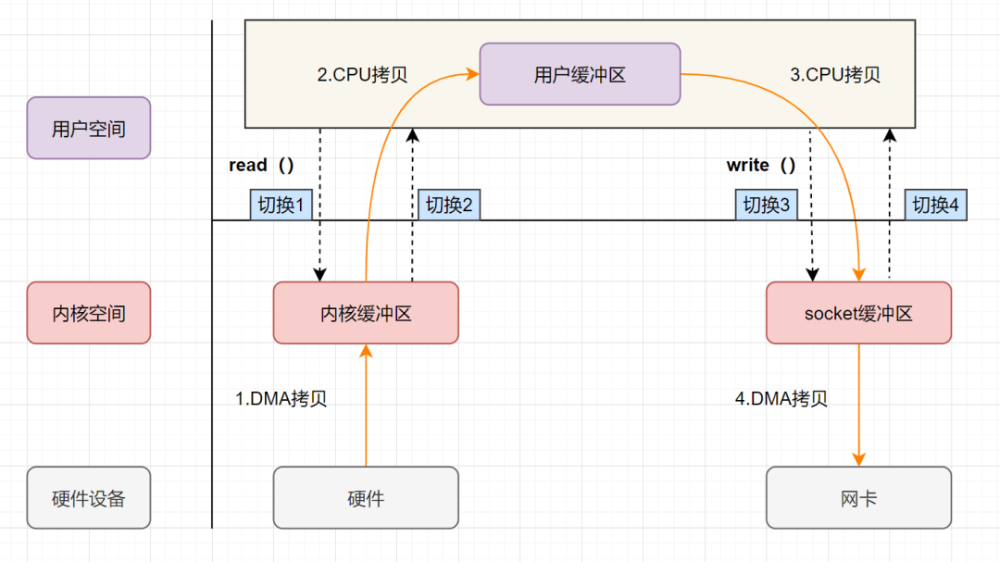

**​零拷贝（Zero-Copy）** 是一种操作系统级别的 I/O 优化技术，旨在减少或避免数据在内存中的多次复制，降低 CPU 占用率，提高数据传输效率，尤其适用于高并发、大吞吐量的场景，如网络通信、文件传输等。

## 传统 I/O 的调用

传统 I/O 操作中，数据需要从磁盘文件复制到内核空间，再从内核空间复制到用户空间，然后再拷贝到 `Socket Buffer` 中，再发送到网卡设备。

传统的 I/O 操作过程中，涉及到 **4 次上下文切换**（用户态和内核态的上下文切换）和 **4 次数据拷贝**（2 次 CPU 拷贝、2 次 DMA 拷贝）：

1. **上下文从用户态切换到内核态**：应用程序进程调用 `read()` ，发起 `I/O 调用`
2. **DMA 拷贝**：`DMA 控制器` 将数据从 `磁盘文件（硬件设备）` 读取到 `内核缓冲区（内核空间）`。
3. **上下文从内核态切换到用户态**：`CPU` 将数据从 `内核缓冲区（内核空间）` 复制到 `用户缓冲区（用户空间）`。
4. **上下文从用户态切换到内核态**：应用程序进程调用 `write()` ，发起 `I/O 调用`
5. **CPU 拷贝**：`CPU` 将数据从 `用户缓冲区（用户空间）` 复制到 `Socket Buffer（内核空间）`。
6. **DMA 拷贝**：`DMA 控制器` 将数据从 `Socket Buffer（内核空间）` 发送到 `网卡设备（硬件设备）`。

## 扩展

### 内核空间和用户空间

- **内核空间**：操作系统内核运行的内存区域，具有最高权限，可以直接访问硬件、内存管理、文件系统等底层资源。
- **用户空间**：应用程序运行的内存区域，具有较低权限，只能访问受限的资源，如自己的内存、文件等，必须通过 **系统调用（System Call）** 请求内核资源。

#### **地址空间划分（以 32 位系统、4GB 为例）：**

- **内核空间**：0xC0000000 ~ 0xFFFFFFFF，约占 1GB，所有进程共享，用于存放内核代码、内核数据、设备驱动等。
- **用户空间**：0x00000000 ~ 0xBFFFFFFF，约占 3GB，每个进程独享，用于存放用户代码、用户数据、栈、堆等。

#### **隔离性**

- **安全性**：防止用户程序误操作（如内存越界）导致系统崩溃。例如，用户态程序无法直接清空内存或配置硬件参数。
- **稳定性**：若用户程序崩溃（如空指针异常），仅影响自身用户空间，内核空间仍可正常运行，保障系统其他进程。
- **资源管理**：内核统一管理硬件资源（CPU、内存、I/O），避免用户程序直接竞争资源。

### 内核态和用户态

- **内核态**：操作系统内核运行的模式，具有最高权限，可直接访问硬件、内存管理、文件系统等底层资源。
- **用户态**：应用程序运行的模式，具有较低权限，只能访问受限的资源，如自己的内存、文件等，必须通过 **系统调用（System Call）** 请求内核资源。

#### **如何切换？**

| **场景**       | 描述                                                         |
|----------------|------------------------------------------------------------|
| **系统调用**   | 用户程序主动请求内核服务（如`write()`），通过`int 0x80`指令触发切换。 |
| **异常**       | CPU执行用户程序时发生错误（如缺页异常），强制切换到内核态处理。        |
| **硬件中断**   | 外设完成操作后（如磁盘I/O完成），中断信号触发切换。                  |

**用户态 → 内核态**：

- 执行特权指令（如`int 0x80`），CPU切换到Ring 0。
- 保存用户态现场（寄存器、用户栈指针）到内核栈。
- 执行内核代码（如系统调用处理程序）。

**内核态 → 用户态**：

- 内核代码执行完毕（如文件写入完成）。
- 恢复用户态现场（从内核栈加载寄存器、用户栈指针）。
- 通过`sysret`指令切换回Ring 3，继续用户程序。

> **示例**：用户程序调用`write()`写入文件时：
>
> 1. 用户态程序通过库函数触发系统调用。
> 2. CPU切换到内核态，保存用户栈到内核栈。
> 3. 内核执行文件写入，完成后恢复用户栈。
> 4. CPU切换回用户态，程序继续执行。

### DMA

**DMA（Direct Memory Access，直接内存访问）** 是一种硬件机制，允许外设直接与计算机内存交换数据，**不需要 CPU 介入每一步拷贝**。它是现代计算机系统中提升效率、减少CPU占用率的核心技术。
