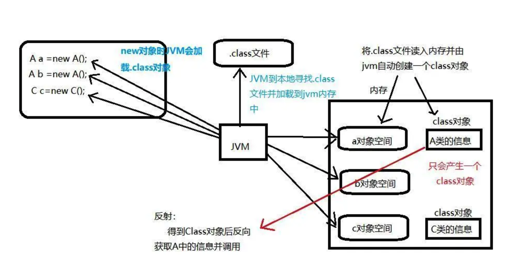
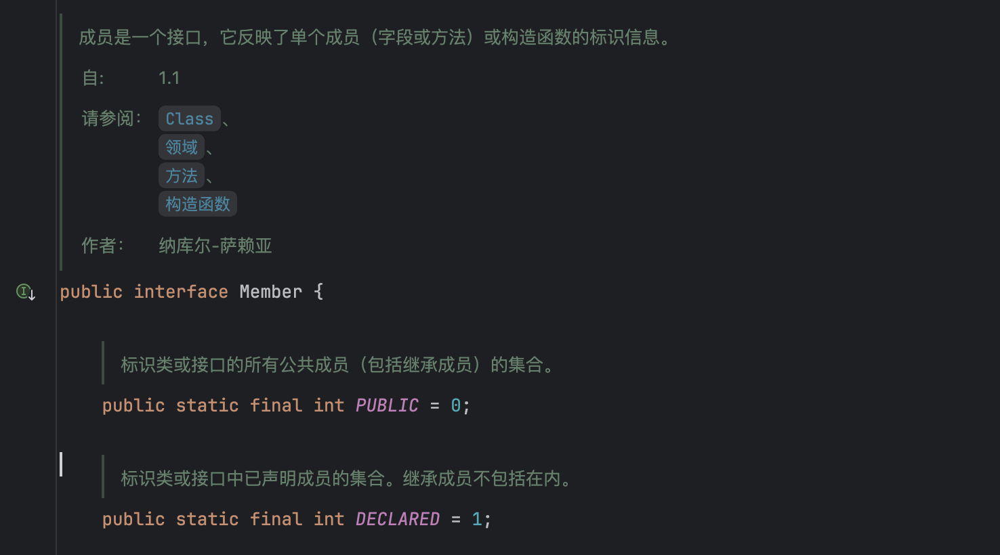

**反射（Reflection）** 是`Java`语言的一个特性，它允许程序在 **运行时(runtime)** 动态分析、检查和修改类、对象、方法、字段等的能力。它突破了传统代码的静态限制，允许程序在运行期间 **自省（introspect）** 和 **动态操作**。

**核心思想**: 将类的结构（方法、字段、构造函数等）映射为Java对象，通过API直接操作。

**类对象是何时产生的？**: 在类加载时产生的。在Java程序启动时，JVM会加载所需的类，并为每个类创建一个Class对象，这个对象包含了该类的所有结构信息，可以通过反射机制获取。

> 反射机制是Java被视为`动态语言`的关键特性之一。



## 核心原理

Java反射的核心原理基于JVM的类加载机制和Java的类型系统:

- **类加载机制**: 当Java程序运行时，JVM会加载所需的类，并为每个类创建一个Class对象，这个对象包含了该类的所有结构信息。
- **Class对象**: 每个类在JVM中都有且只有一个对应的Class对象，这个对象是反射的入口点。
- **运行时类型信息(RTTI)**: Java在运行时保留了对象的类型信息，这使得反射成为可能。

## 核心API

Java反射的核心类位于 `java.lang.reflect` 包中，关键API包括:

| 类/接口                        | 作用                                     |
|-------------------------------|-----------------------------------------|
|`java.lang.Class`              |表示一个类或接口的特性，如名称、字段、方法等     |
|`java.lang.reflect.Field`       |提供了类或接口的单个字段的信息和动态访问        |
|`java.lang.reflect.Method`      |提供了类或接口上单个方法的信息和访问权限        |
|`java.lang.reflect.Constructor` |提供了类的单个构造函数的信息和访问权限          |
|`java.lang.reflect.Array`       |提供了动态创建和访问 Java 数组的静态方法       |
|`java.lang.reflect.Modifier`     |提供了静态方法和常量，用于解码类和成员访问修改器 |

## 典型场景

1. **框架开发**
   - Spring的依赖注入（IoC）、MyBatis的ORM映射。
2. **动态代理**
   - 结合`InvocationHandler`实现AOP（如日志、事务）。
3. **序列化与反序列化**
   - 如Jackson/GSON通过反射读取字段生成JSON。
4. **IDE和调试工具**
   - 代码自动提示、对象属性查看。
5. **测试框架**
   - JUnit通过反射调用测试方法。

## 核心操作步骤

### 获取类的`Class`对象

```java
// 方式1: 通过类名.class
Class<?> clazz = String.class;

// 方式2: 通过对象.getClass()
String str = "Hello";
Class<?> clazz = str.getClass();

// 方式3: 通过Class.forName()（最常用）
Class<?> clazz = Class.forName("java.lang.String");

// 方式4: 调用类的加载器
ClassLoader cl = this.getClass().getClassLoader();
Class<?> clazz = cl.loadClass("java.lang.String");
```

### 操作构造函数: 动态创建对象

```java
// 获取无参构造器并创建对象
Constructor<?> constructor = clazz.getConstructor();
Object instance = constructor.newInstance();

// 获取有参构造器（例如: String的byte[]构造器）
Constructor<?> constructor = clazz.getConstructor(byte[].class);
Object instance = constructor.newInstance(new byte[]{65, 66});
```

#### getXXX() 和 getDeclaredXXX() 的区别

| 方法 | 访问范围 | 是否包含私有成员 | 是否包含继承成员 |
|------|----------|------------------|------------------|
| **`getXXX()`** | 仅返回 **public** 成员 | ❌ 不包含 | ✅ 包含父类的 `public` 成员 |
| **`getDeclaredXXX()`** | 返回 **所有权限** 的成员（public/protected/private/default） | ✅ 包含 | ❌ 仅限当前类 |

#### getXXX() 和 getDeclaredXXX() 的使用场景对比

| **场景**               | **推荐方法**          |
|------------------------|----------------------|
| 获取公共 API（如框架调用） | `getXXX()`           |
| 访问私有成员（如测试、破解单例） | `getDeclaredXXX()` + `setAccessible(true)` |
| 需要继承的成员          | `getXXX()`           |
| 仅操作当前类成员        | `getDeclaredXXX()`   |

#### 注意事项

1. **继承关系**：
   - `getXXX()` 会查找父类的 `public` 成员。
   - `getDeclaredXXX()` 仅限当前类，不检查父类。

2. **访问私有成员**：
   - 通过 `getDeclaredXXX()` 获取私有成员后，需调用 `setAccessible(true)` 解除访问限制。

3. **性能影响**：
   - 反射操作比直接调用慢，必要时可缓存 `Method`/`Field` 对象。

4. **模块化系统（Java 9+）**：
   - 如果类在模块中，需在 `module-info.java` 中开放权限（`opens`）才能反射访问非 `public` 成员。



### 操作方法: 动态调用

```java
// 获取方法（例如: String的substring方法）
Method method = clazz.getMethod("substring", int.class, int.class);

// 调用方法（对某个实例执行）
Object result = method.invoke("Reflection", 2, 5);  // 输出 "fle"
```

#### `Method.invoke()` 的返回值规则

`result` 的可能情况：

| 被调用方法的返回类型 | `invoke()` 返回的 `result` 类型 | 示例 |
|----------------------|--------------------------------|------|
| **有返回值的方法** | 返回 `Object`（实际为方法返回值） | `String.substring()` → `String` |
| **返回 `void` 的方法** | 返回 `null` | `List.clear()` → `null` |
| **基本类型（如 `int`）** | 自动装箱为包装类（如 `Integer`） | `String.length()` → `Integer` |
| **静态方法** | 正常返回（`obj` 参数传 `null`） | `Math.max()` → `Integer` |
| **方法抛出异常** | 封装成 `InvocationTargetException` | - |

#### 为什么返回 `Object` 而不是具体类型？

- **反射的通用性**：`Method.invoke()` 需要适配任意方法签名，`Object` 是所有类型的超类。
- **类型安全**：由开发者自行处理强制转型（编译器无法检查反射调用的返回类型）。

### 操作字段: 动态读写属性

```java
// 获取字段（例如: Integer的MAX_VALUE）
Field field = Integer.class.getDeclaredField("MAX_VALUE");

// 读取字段值（静态字段可传null）
int max = (int) field.get(null);  // 输出2147483647

// 修改字段值（需注意final字段可能抛出异常）
field.setAccessible(true);  // 突破private限制（慎用！）
field.set(null, 100);       // 危险操作！可能破坏程序逻辑。
```

## 优缺点

### 优点

- **动态性**: 允许在运行时动态地获取和操作类的信息，而不需要在编译时知道类的具体细节
- **灵活性**: 可以通过类名字符串来创建对象实例，可以在运行时动态调用方法和字段，以及访问和修改私有成员
- **扩展性**: 可以用于实现一些高级功能，如动态代理、注解处理、依赖注入等

### 缺点

- **性能开销**: 反射操作通常比直接调用慢，因为它需要在运行时获取和操作类的信息，需要额外的处理开销
- **安全问题**: 反射可以访问和修改私有成员，这可能导致安全隐患和程序逻辑错误
- **复杂性**: 使用反射可能会使代码变得复杂和难以理解，增加了维护成本
